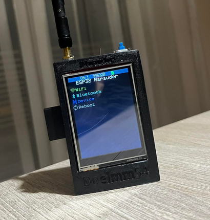

# Journal  / WebSec-Marauder

Project initialized
- Created repository and documented project purpose as an educational, defensive tool.
- Added README with safety and ethics guidance; offensive features listed as disabled for transparency.

Inventory & documentation
- Added hardware parts list and placeholder wiring diagram.
- Planned tests: passive Wi-Fi scanning on my own test network, passive Bluetooth discovery, microSD logging validation, and OTA update check.

Planned: Passive testing
- Test passive Wi-Fi scanning and record sample logs (SSID/BSSID/RSSI) on home network.
- Validate signal strength monitoring and display on OLED.
- Validate microSD logging and HTTP upload flow to private server (for analysis only).

> **Image disclaimer:** The product/board images in this repo are for documentation and demo purposes only. The ESP32/Marauder images were downloaded as reference/demo images from the web to represent the prototype — they do not imply the physical hardware is currently in-hand. I will update the repository with original photos and receipts when the components are available.
